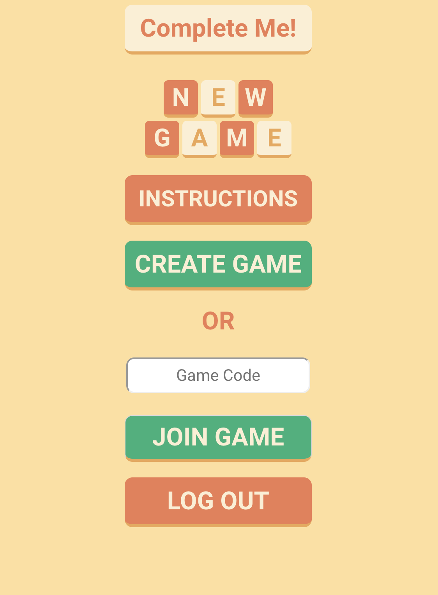
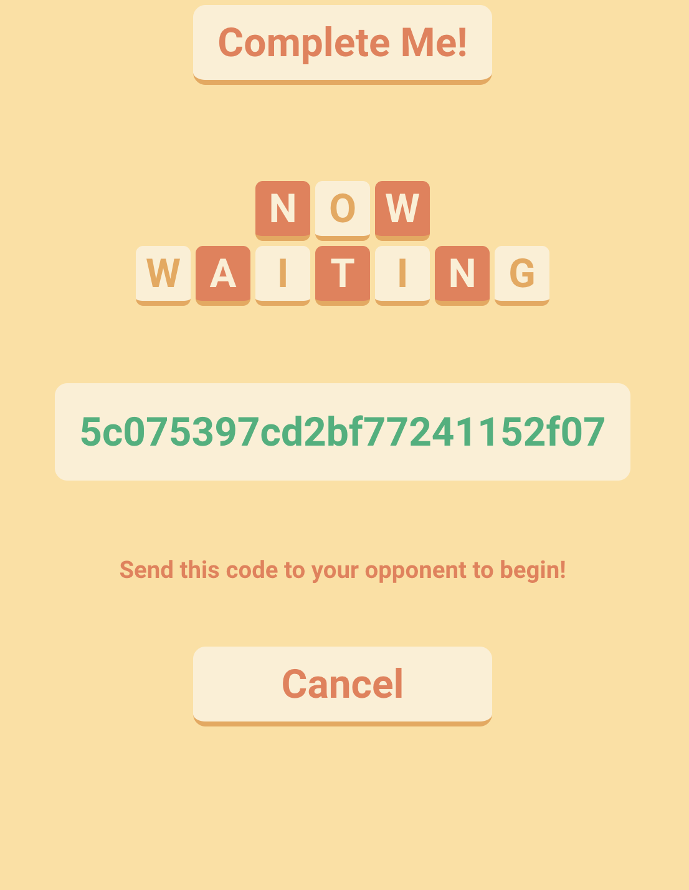
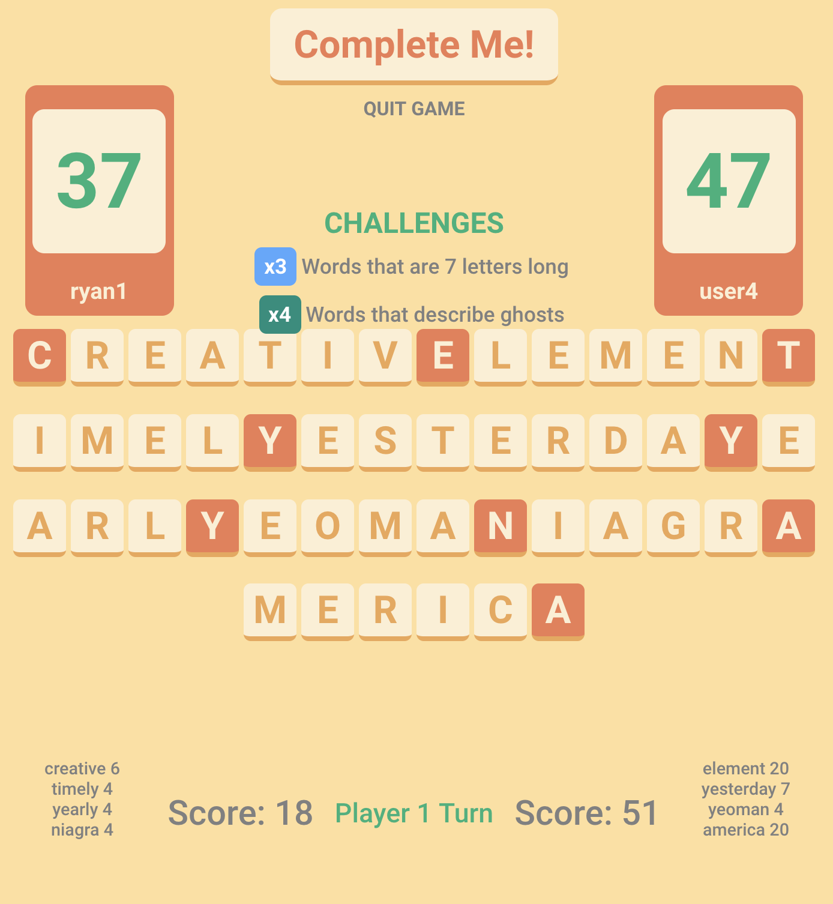
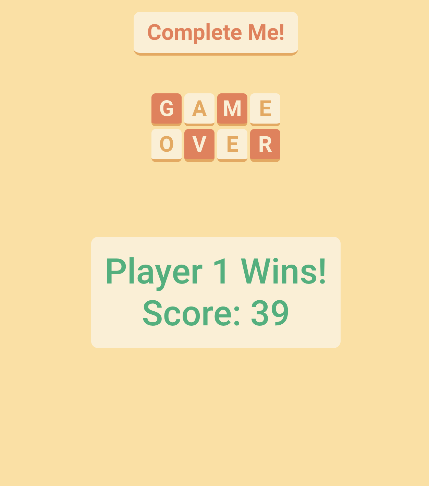

# Complete-Me!

## Introduction
Multiplayer word completion game that tests your English vocabulary.
Complete the word using the last letter of the previous word.
Longer words get more points. 1 Point for every letter in between.
Match words to the randomized word challenges and acquire score multipliers!
Each player is given a total of 60 seconds to submit words each game.
Your timer is paused during your opponent's turn.
Quickly submit your words because if a player runs out of time, the other player may start and complete their own words until their timer runs out.
Higher score per round, wins!

## Technologies Used 
- NodeJS 
- Heroku
- ExpressJS
- ReactJS
- Socket.io
- HTML / CSS
- Javascript
- Datamuse API
- JSON Web Tokens
- MongoDB / Mongoose / mLab

### API
[Datamust API](https://www.datamuse.com/api/)

### Complete-Me Trello
[Trello Board](https://trello.com/b/tjasIU3z/complete-me)

### Getting Started
[Click to play!](https://complete-me-multiplayer.herokuapp.com/)
- Create an account by pressing signup or press login to begin playing.
- Create a game and send the link to your opponent.
- Paste the link inside the Game Code input and press Join Game.

### Next Steps / Unsolved Problems
- Challenge room to choose active opponents
- Add more challenges to future updates
- Mobile responsiveness
- Polish colors to differentiate components
